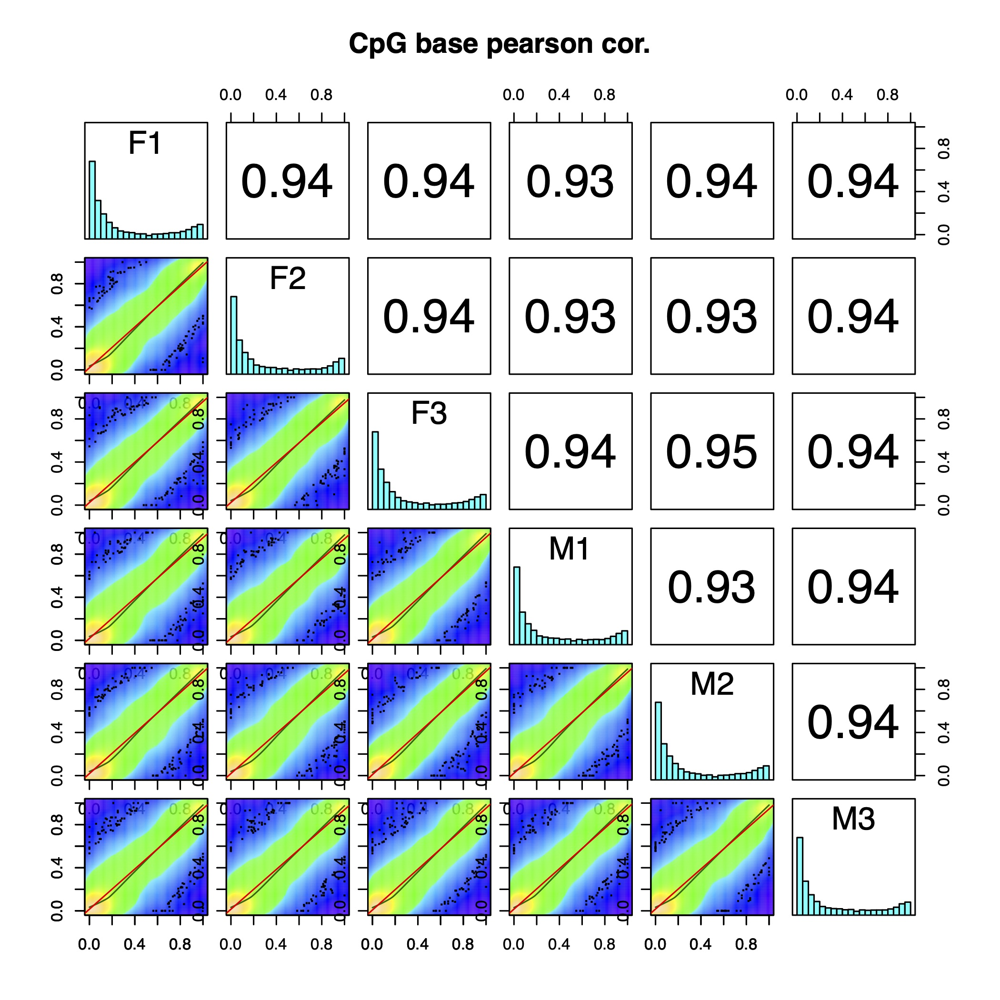
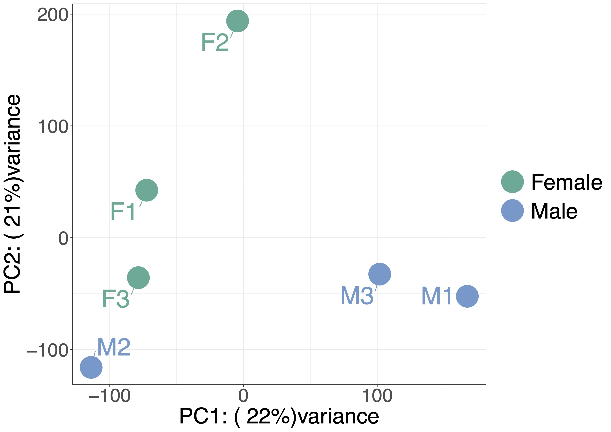

# Differential DNA methylation between male and female Asian Citrus Psyllid

## Quality checking of data
**Methods:** Data were quality checked using fastqc v0.11.8 ([Andrews 2010](https://www.bioinformatics.babraham.ac.uk/projects/fastqc/)).

**Results:**
The data look beatutiful, no need for any trimming (already done by novagene I believe as reads are 140bp). Fastqc reports can be found [here](https://www.dropbox.com/sh/x77ogcoe0um250i/AAB-PO2nCbTiKzgdi9fPB8aEa?dl=0).

---

## Alignment to the reference genome
**Methods:** Samples were aligned to the reference genome Diaci v3.0 ([Hosmani et al. 2020](https://www.biorxiv.org/content/10.1101/869685v1)) and also the lambda genome to determine the bisulfite conversion rate using Bismark v0.20.0 ([Krueger and Andrews 2011](https://pubmed.ncbi.nlm.nih.gov/21493656/)).

**Results:**
0% reads have aligned to the reference genome or the lambda genome in paired-end mode. Xiudao sent the methods used by Novogene and it all looked standard. Novogene suggested aligning using the --dovetail argument and this has done nothing. I also tried a different lambda genome and still nada. Following [this](https://github.com/FelixKrueger/Bismark/blob/master/Docs/FAQ.md#mapping-strategies-for-paired-end-data) I have now successfully aligned the reads WOO! I have used single-end mode and we have about 1% of reads aligning to the lambda genome and the conversion looks good. Using just single-end mode (and --pbat for read 2) we get about 30% alignment rate to Diaci v3.0. By decreasing the alignment stringency slightly the alignment rate has increased to about 50% which is much better.

Alignment reports can be found [here](https://www.dropbox.com/sh/nnbg3ff8mqrde29/AAAzwR98UImg7NNKR_Qz9wgOa?dl=0). 

*D. citri* has about 1% CpG methylation and 0% in a non-CpG context. This is pretty standard for an insect and a useable amount. Exciting! Around 20% of sequences are PCR duplicates (standard), after removing duplicates we have a final coverage of 13X on average, this is ok.

---

Calculate genome size (total bases) for coverage calculation:

`grep -v ">" Diaci_v3.0.ref.fa | tr -d '\n' | wc -c`

---
## Differential DNA methylation between males and females
**Methods:** Coverage outliers (above the 99.9th percentile) and bases with less than 10 reads were removed and only CpG positions meeting these criteria in all samples were kept. CpG sites were the filtered to keep only sites which were methyhlated in at least one sample for differential DNA methylation testing. This was done by running a binomial test per position where the probability of success was the bisulfite non-conversion rate, p-values were corrected for multiple testing using the Benjamini-Hochberg method and a site was classed as methylated if the corrected p-value was &lt;0.05. A logistic regression model was then applied via the R package MethylKit (REF) to determine differentially methylated CpG positions between males and females. A CpG was classed as differentially methylated if the corrected q-value was &lt;0.05 and the absolubte methylation difference was &gt;15%.

**Results:** A total of 107,710 CpG sites were classed as methylated in at least one sample. Samples show good correlation with each other showing the majority of CpG methylation is stable between the sexes (Fig.1). Males and females cluster relativly well although M2 and F3 cluster together, this may possibly be driven by the genotype / realtedness of the pools of individuals (Fig.2). 599 sites were differentially methylated between males and females (q &lt;0.05 and minimum methylation difference &gt;15%). (ADD MORE RESULTS HERE ONCE HAVE THEM).

Fig.1: Correlation across samples for all tested CpG positions (N=107,710). 

Fig.2: PCA plot based on all tested CpG positions (N=107,710). 