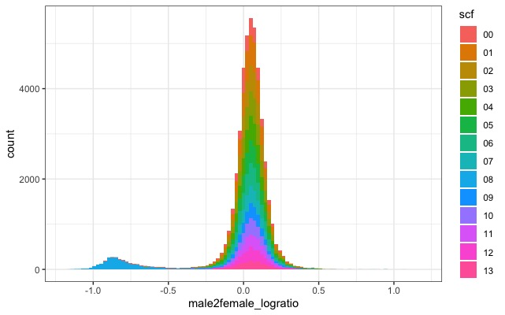
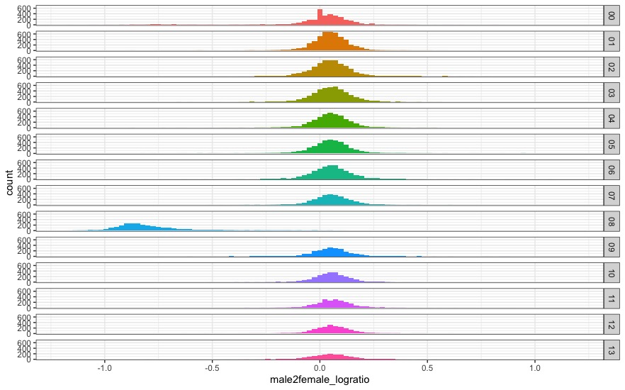
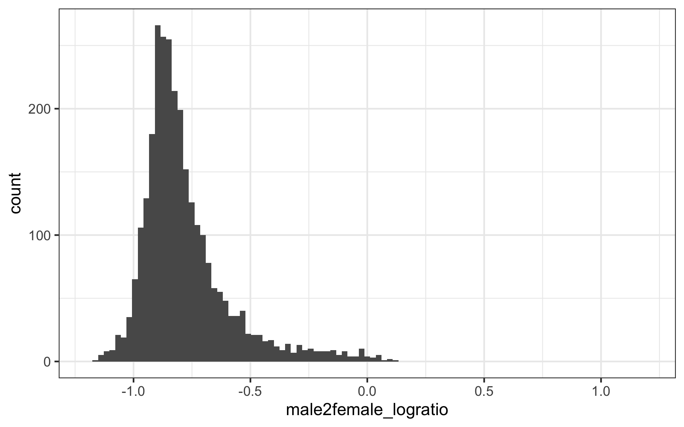

# Asian Psyllid Sex-Specific DNA Methylation

This project is a collaboration with Dr. Xiudao Yu and Dr. Zhanjun Lu from Gannan Normal Universtiy, Jiangxi, China. We plan to identifiy genome-wide differences in DNA methylation between male and female *Diaphorina citri*, including the relationship of DNA methylation with gene expression and the DNA methylation differences in the sex chromosomes. This [paper](https://doi.org/10.1111/mec.15216) in aphids shows roughly what we want to achieve.

---

## Task 1: Determine the sex chromosome system

There is a chromosome level assembly of *D. citri* but the sex chromosomes have not been identified. Xiudao has therefore carried out whole genome resequencing of male and female *D. citri* so we can attempt to determine whether the system is XO or XY.

Genome and annotation: the chromosome level assembly paper is avaliable [here](https://www.biorxiv.org/content/10.1101/869685v1). As it is still a pre-print and not published ther authors have not yet released the full version. I have emailed the authors and obtained version 3 plus a current annotation file.

I will follow Kamil's coverage pipeline to see if we have clear coverage differences in one particular chromosome set in males vs females: [https://github.com/RossLab/PGE/blob/master/sex_chromosome_p_citry.md.](https://github.com/RossLab/PGE/blob/master/sex_chromosome_p_citry.md).

**Current Progress:** Following Kamil's pipeline above I have successfully identified that the X chromosome is chromosome 8. I have now also ran a windowed coverage approach to look for the Y chromosome. I have found no clear distributions >0.5 male2femaleLogRatio meaning there is no divereged Y present. The system is most likely X0 however, I cannot rule out a newly evolved Y chromosome using this method. Question: is this analysis good enough to confirm X0 or is there more we can do, with the RNA-Seq for example? The problem is we are using pools of individuals so it makes looking for SNPs which may differ between XY a little tricky, but not impossible maybe???

---

## Future tasks:

- Genome-wide DNA methylation differences between males and females
    - Overall levels including non-CpG (boxplots)
    - Chromosome level differences (including sex chromosomes) (I like Mather's et al. density plot better than our current one)
    - PCA clustering
    - Mean feature levels (e.g. promotors/exons etc.)
    - Counts in high/medium/low/no bins per feature
    - Exon/intron average levels per gene, **ask Rahia for code**
- Differential DNA methylation on the CpG and feature level
    - Location of differentially methylated CpGs and count
    - Relative position in gene (if enriched there)
    - MA / scatter plot 
    - Gene ontology (GO) enrichment of differentially methylated genes **(Have GO terms been annotated?)**
- Genome-wide relationship between DNA methylation and expression
    - Gene level scatter plots
    - Mean FPKM per binned methylation (line graph)
    - FPKM per highly binned methylation (violin plot)
- Differential gene expression and alternative splicing between sexes
    - Identify differentially exp genes and various standard plots
    - Identifiy differentially alternativly spliced genes
        - check *doublesex*
    - GO enrichment for both
    - Overlap of differentially expressed and differentially alternativy spliced 
- Relationship of differentially methylated genes and differentially expressed/spliced
    - General scatter of overexpressed genes and hypermethtylated genes etc.
    - Male/female biased methylated/expressed enriched on the X?
    - Overall methylation levels of differentially expressed/spliced
    - Overall expression levels of differentially methylated

## Other thoughts:
- Do we want to annotate TEs and include them in the analyses?
